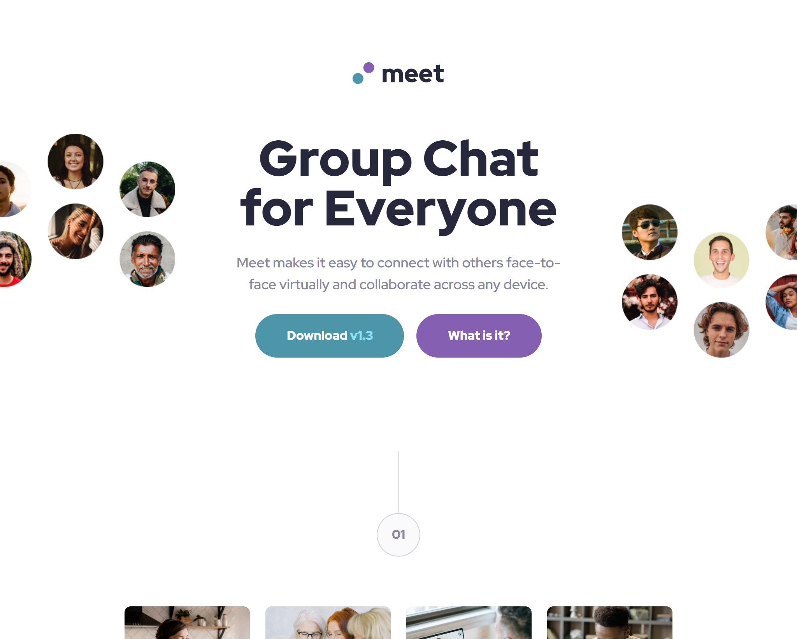
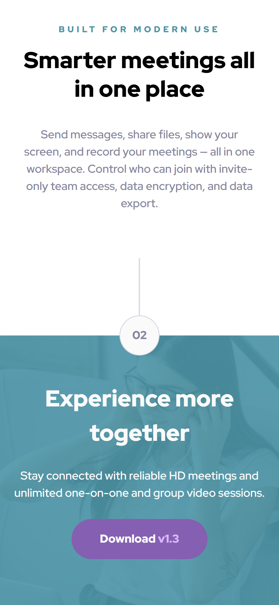

# Frontend Mentor - Meet landing page solution

This is a solution to the [Meet landing page challenge on Frontend Mentor](https://www.frontendmentor.io/challenges/meet-landing-page-rbTDS6OUR). Frontend Mentor challenges help you improve your coding skills by building realistic projects. 

## Table of contents

- [Overview](#overview)
  - [The challenge](#the-challenge)
  - [Screenshots](#screenshot)
  - [Links](#links)
- [My process](#my-process)
  - [Built with](#built-with)
  - [What I learned](#what-i-learned)
  - [Continued development](#continued-development)
- [Author](#author)

## Overview

### The challenge

Users should be able to:

- View the optimal layout depending on their device's screen size
- See hover states for interactive elements

### Screenshots

### Links

- Live Site URL: [https://taupe-taffy-5ba57b.netlify.app/](https://taupe-taffy-5ba57b.netlify.app/)

## My process

As usually i've started with design mobile design first, this time however i hard coded the data inside components. After having html and visual styling I've proceeded styling for tablet and then destkop. I had to go back few times on my tablet changes when I was dealing with destkop size. Doing both of those sizes at once would probably save me some time.

### Built with

- Flexbox
- CSS Grid
- Mobile-first workflow
- [TS](https://www.typescriptlang.org/) - Typescript
- [React](https://reactjs.org/) - JS library
- [Tailwindcss](https://tailwindcss.com/) - CSS library

### What I learned

I tinkered with bg images responsiveness and I think I got better at it. I also get to use flexbox a lot, grid not so much. Most satisfying was when I fixed positioning bug in a footer. I found out that relative positioning can be a really good friend.

### Continued development

I liked the challenge it took me for quite a ride. I think I'll be using some of the tricks I learned like relative positioning for overlays and such.

## Author

- Frontend Mentor - [@raswonders](https://www.frontendmentor.io/profile/raswonders)
- Twitter - [@raswonders](https://www.twitter.com/raswonders)
- LinkedIn - [Rastislav Hepner](https://www.linkedin.com/in/rastislavhepner/)
